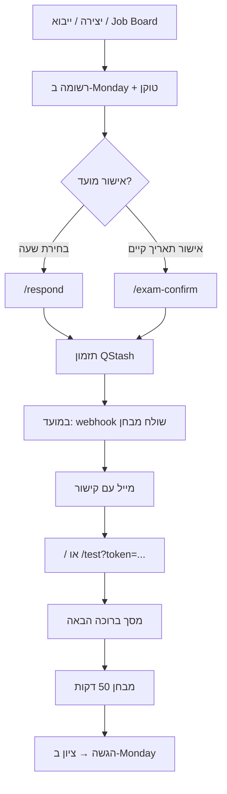

# [beyond] code — מערכת מבחנים למועמדות

פלטפורמת מבחנים טכניים למועמדות בתהליך גיוס, בנויה ב-**Next.js 15** (App Router), **TypeScript** ו-**Tailwind CSS 4**, עם אינטגרציה מלאה ל-**Monday.com**, תזמון דרך **Upstash QStash**, ושליחת מיילים ב-**SMTP**.

המערכת מאפשרת למנהלת הגיוס ליצור מועמדות, לתזמן מבחנים, לנהל שאלות — ולמועמדות לבצע מבחן מאובטח בזמן שנקבע, תוך עדכון אוטומטי של Monday.

---

## תוכן עניינים

- [יכולות עיקריות](#יכולות-עיקריות)
- [מסלול המועמדת](#מסלול-המועמדת)
- [לוח בקרה למנהלת](#לוח-בקרה-למנהלת)
- [ארכיטקטורה וזרימת נתונים](#ארכיטקטורה-וזרימת-נתונים)
- [התקנה והרצה](#התקנה-והרצה)
- [משתני סביבה](#משתני-סביבה)
- [אינטגרציית Monday.com](#אינטגרציית-mondaycom)
- [Webhooks ותזמון QStash](#webhooks-ותזמון-qstash)
- [מבחן — כללים ואבטחה](#מבחן--כללים-ואבטחה)
- [מבנה הפרויקט](#מבנה-הפרויקט)
- [API](#api)
- [דפים ציבוריים](#דפים-ציבוריים)
- [הערות אבטחה](#הערות-אבטחה)
- [פריסה (Deployment)](#פריסה-deployment)

---

## יכולות עיקריות

| תחום | תיאור |
|------|--------|
| **מבחנים** | שלושה סוגי מבחן (א / ב / ג), שאלות רב-ברירה, ציון אוטומטי, סף עמידה 60 |
| **Monday.com** | לוח מרכזי למועמדות, סטטוסים, תאריכים, ציונים ותוצאות |
| **קישורי גישה** | טוקן ייחודי לכל מועמדת — ללא התחברות עם סיסמה |
| **תזמון** | תאריך ושעת מבחן בזמן ישראל, חלון כניסה של 15 דקות |
| **שליחת מייל** | QStash מפעיל את Monday/SuperMail לשליחת הזמנה במועד |
| **ייבוא Excel** | העלאת רשימת מועמדות בבת אחת |
| **Job Boards** | יצירה אוטומטית מלוח גיוס כשמועמדת מאושרת |
| **ממשק עברי (RTL)** | כל חוויית המועמדת והמנהלת בעברית |

---

## מסלול המועמדת



### שלבים מפורטים

1. **יצירת מועמדת** — דרך לוח המנהלת, ייבוא Excel, או webhook מלוח גיוס (Job Board).
2. **אישור מועד** — לפי תהליך הגיוס:
   - `/respond?token=...` — בחירת תאריך ואחת משלוש שעות קבועות (10:00, 17:00, 20:00).
   - `/exam-confirm?token=...` — אישור תאריך שכבר נקבע.
3. **תזמון** — נרשם `scheduledAt` ב-Monday ומתוזמנת הודעת QStash יחידה (`deduplicationId`: `exam-invite-{itemId}`).
4. **שליחת הזמנה** — במועד המבחן, QStash קורא ל-`/api/webhooks/send-exam-invite`; המערכת בודקת זכאות ומעדכנת סטטוס ל-**שלח מבחן כעת** כדי ש-SuperMail ב-Monday ישלח את המייל.
5. **כניסה למבחן** — המועמדת מדביקה את הקישור בדף הבית (`/`) או נכנסת ישירות ל-`/test?token=...`.
6. **ביצוע והגשה** — טיימר קשיח, מעקב אחר יציאה מטאב, שמירה מקומית ב-`localStorage`, עדכון ציון וסטטוס ב-Monday.

---

## לוח בקרה למנהלת

נגיש בכתובת **`/admin`** (מוגן בסיסמה — `ADMIN_PASSWORD`).

| אזור | תיאור |
|------|--------|
| **מועמדת חדשה** | יצירת פריט ב-Monday, טוקן, קישור למבחן, סוג מבחן, מקור, מסלול (רגיל / ג'וניור), תאריך מבחן |
| **ייבוא Excel** | העלאת קובץ עם עמודות: שם, שם משפחה, מייל, טלפון, סמינר, הערות, שם מבחן |
| **תזמון קבוצה** | קביעת תאריך מבחן לכל הפריטים בקבוצת Monday |
| **עריכת מבחנים** | עריכת שאלות, אפשרויות ותשובות נכונות לכל סוג מבחן (בזיכרון השרת — ראו הערה למטה) |

---

## ארכיטקטורה וזרימת נתונים

```
┌─────────────┐     ┌──────────────┐     ┌─────────────┐
│  דפדפן      │────▶│  Next.js API │────▶│  Monday.com │
│  (מועמדת /  │     │  (שרת בלבד)  │     │  Central    │
│   מנהלת)    │◀────│              │◀────│  Exam Board │
└─────────────┘     └──────┬───────┘     └─────────────┘
                           │
                    ┌──────┴───────┐
                    │ Upstash      │
                    │ QStash       │──▶ /api/webhooks/send-exam-invite
                    └──────────────┘
```

- **סודות** (Monday API, SMTP, QStash, סיסמת מנהלת) נשארים בצד השרת בלבד.
- **טוקן המועמדת** מאוחסן בעמודת Monday ומאומת בכל בקשת API.
- **תאריכים** נשמרים ב-UTC ב-Monday ומוצגים בזמן ישראל (Jerusalem wall clock).

---

## התקנה והרצה

### דרישות

- Node.js 20+
- npm
- חשבון Monday.com עם לוח מבחנים מרכזי (Central Exam Board)
- חשבון Upstash QStash (לתזמון שליחת מבחנים בפרודקשן)
- שרת SMTP (למשל Google Workspace)

### שלבים

```bash
# שכפול והתקנת תלויות
git clone <repo-url>
cd candidate-testing-platform
npm install

# הגדרת משתני סביבה
cp .env.example .env.local
# Windows PowerShell:
# Copy-Item .env.example .env.local

# עריכת .env.local עם הערכים האמיתיים

# הרצה מקומית
npm run dev
```

האפליקציה תיפתח ב-[http://localhost:3000](http://localhost:3000).

### פקודות npm

| פקודה | תיאור |
|--------|--------|
| `npm run dev` | שרת פיתוח (Turbopack) |
| `npm run build` | בניית production |
| `npm run start` | הרצת שרת production |
| `npm run lint` | בדיקת ESLint |

---

## משתני סביבה

העתיקו מ-`.env.example` ל-`.env.local` ומלאו ערכים אמיתיים. **אל תעלו `.env.local` ל-Git.**

| משתנה | שימוש | הערות |
|--------|--------|--------|
| `MONDAY_API_KEY` | שרת בלבד | טוקן API מ-Monday (ללא `Bearer`, ללא מרכאות) |
| `MONDAY_BOARD_ID` | שרת בלבד | מזהה לוח המבחנים המרכזי |
| `MONDAY_WEBHOOK_SECRET` | שרת בלבד | סוד לאימות `/api/monday-webhook?secret=...` |
| `ADMIN_PASSWORD` | שרת בלבד | סיסמה לכניסה ל-`/admin` |
| `NEXT_PUBLIC_APP_URL` | לקוח + שרת | כתובת ציבורית של האפליקציה (קישורי מבחן, webhooks) |
| `SMTP_HOST` | שרת בלבד | למשל `smtp.gmail.com` |
| `SMTP_PORT` | שרת בלבד | ברירת מחדל: `587` |
| `SMTP_USER` | שרת בלבד | ברירת מחדל: `dev@beyondtcode.com` |
| `SMTP_PASSWORD` | שרת בלבד | סיסמת אפליקציה / SMTP |
| `QSTASH_URL` | שרת בלבד | כתובת QStash (למשל `https://qstash-eu-central-1.upstash.io`) |
| `QSTASH_TOKEN` | שרת בלבד | טוקן פרסום הודעות |
| `QSTASH_CURRENT_SIGNING_KEY` | שרת בלבד | אימות חתימת webhook |
| `QSTASH_NEXT_SIGNING_KEY` | שרת בלבד | מפתח חתימה הבא (רוטציה) |

גישה למשתנים דרך `src/lib/env.ts` — **רק** ב-Server Components, Route Handlers או Server Actions.

> **חשוב:** QStash דוחה כתובות `localhost`. בפיתוח מקומי, תזמון שליחת מבחנים ייכשל אלא אם `NEXT_PUBLIC_APP_URL` מצביע לכתובת ציבורית (למשל tunnel של ngrok).

---

## אינטגרציית Monday.com

### לוח מרכזי (Central Exam Board)

כל המועמדות נוצרות ומנוהלות בלוח אחד (`MONDAY_BOARD_ID`). מזהי העמודות מוגדרים ב-`src/lib/monday/columns.ts`:

| עמודה | מזהה | תיאור |
|--------|------|--------|
| שם | `name` | שם המועמדת |
| מייל | `email_mm3xm226` | כתובת מייל |
| מייל צוות | `email_mm3zrjey` | ברירת מחדל: `office@beyondtcode.com` |
| טוקן | `text_mm3x9923` | קישור גישה למבחן |
| סטטוס מבחן | `color_mm3xcqrz` | טרם התחיל → שלח מבחן כעת → בתהליך → הוגש / חסום |
| אישור מועמד | `color_mm3y4vv1` | אושר / נדחה / ממתין לאישור |
| סוג מבחן | `color_mm3zj3j9` | מבחן א / ב / ג |
| מקור | `text_mm3zwgfx` | LinkedIn, חבר/ה, וכו' |
| תאריך מבחן | `date_mm3y4hj6` | תאריך ושעה מתוזמנים |
| טלפון | `phone_mm40xg8n` | |
| מסלול | `color_mm4cdx81` | רגיל / ג'וניור |
| ציון | `numeric_mm3x35gv` | 0–100 |
| עבר / לא עבר | `color_mm4089xy` | לפי ציון ≥ 60 |
| יציאות מטאב | `numeric_mm3x9dsz` | מעקב אחר עזיבת מסך |

### Job Boards

לוחות גיוס דינמיים יכולים לקשר למועמדת בלוח המרכזי דרך עמודת `board_relation_mm44c77e`. כשסטטוס משתנה ב-Job Board, webhook יוצר פריט חדש בלוח המבחנים ומאתחל טוקן.

### סוגי מבחן

| מזהה פנימי | תווית Monday |
|------------|--------------|
| `exam-a` | מבחן א |
| `exam-b` | מבחן ב |
| `exam-c` | מבחן ג |

---

## Webhooks ותזמון QStash

### מתי מתוזמן שליחת מבחן?

הודעת QStash אחת לכל מועמדת (`exam-invite-{itemId}`) מתוזמנת כאשר:

- מנהלת יוצרת מועמדת עם תאריך מבחן
- מועמדת בוחרת שעה ב-`/respond`
- מועמדת מאשרת מועד ב-`/exam-confirm`
- Monday מדווח על שינוי סטטוס **אושר** בעמודת `color_mm3y4vv1`
- מנהלת מעדכנת תזמון לקבוצה שלמה

אם המועד כבר עבר — ההודעה נשלחת מיד.

### Endpoints ל-webhooks

| Endpoint | מקור | תפקיד |
|----------|------|--------|
| `POST /api/webhooks/send-exam-invite` | QStash | במועד המבחן — בדיקת זכאות ועדכון סטטוס לשליחת מייל |
| `POST /api/webhooks/monday-status-change` | Monday | אישור מועמדת / יצירה מ-Job Board |
| `POST /api/monday-webhook?secret=...` | Monday | יצירת פריט חדש בלוח המרכזי + אתחול טוקן |

### הגדרת Monday webhook

1. ב-Monday: Automations / Integrations → Webhooks.
2. כוונו ל-`{NEXT_PUBLIC_APP_URL}/api/webhooks/monday-status-change` (או `/api/monday-webhook?secret=...` ליצירת פריטים).
3. עבור תזמון מחדש — הגדירו webhook על שינוי עמודת **אישור מועמד** לערך **אושר**.

### זרימת QStash

```
יצירה / אישור → scheduleExamInviteAlarm(itemId, scheduledAt)
       ↓
QStash (notBefore = זמן המבחן)
       ↓
POST /api/webhooks/send-exam-invite  { itemId }
       ↓
בדיקה: מאושרת? לא התחילה? יש מייל וטוקן?
       ↓
עדכון examStatus → "שלח מבחן כעת" → SuperMail שולח מייל
```

---

## מבחן — כללים ואבטחה

| כלל | פירוט |
|-----|--------|
| **משך** | 50 דקות (ברירת מחדל; ניתן לעריכה בממשק המנהלת) |
| **חלון כניסה** | 15 דקות מתחילת המועד המתוזמן |
| **יציאה מטאב** | יציאה אחת חוסמת את המבחן מיידית |
| **טיימר** | לא ניתן להשהות; הגשה אוטומטית בסיום הזמן |
| **שמירה** | התקדמות נשמרת ב-`localStorage` לרענון דף |
| **ציון** | כל שאלה שווה חלק שווה מ-100; עמידה מ-60 ומעלה |
| **תשובות נכונות** | לא נשלחות ללקוח — רק לשרת בזמן בדיקה |

---

## מבנה הפרויקט

```
src/
├── app/
│   ├── (admin)/admin/          # לוח בקרה למנהלת (/admin)
│   ├── (candidate)/
│   │   ├── test/               # ממשק המבחן (/test)
│   │   ├── respond/            # בחירת שעת מבחן (/respond)
│   │   └── exam-confirm/       # אישור מועד (/exam-confirm)
│   ├── api/                    # Route Handlers (שרת בלבד)
│   ├── layout.tsx
│   ├── page.tsx                # דף כניסה — הדבקת קישור מבחן (/)
│   └── globals.css
├── components/
│   ├── admin/                  # רכיבי לוח בקרה
│   ├── candidate/              # זרימות מועמדת
│   ├── exam/                   # ממשק מבחן, ברנדינג, כללים
│   └── login/                  # דף הדבקת קישור
├── lib/
│   ├── admin/                  # אימות מנהלת וסשן
│   ├── api/                    # ולידציה, תאריכים
│   ├── candidate/              # טוקן, אתחול, חלונות זמן
│   ├── email/                  # SMTP ותבניות מייל
│   ├── exam/                   # שאלות, ציון, סשן, כללים
│   ├── excel/                  # פרסור קובץ Excel
│   ├── monday/                 # לקוח API, עמודות, תזמון
│   ├── qstash/                 # תזמון ואימות webhooks
│   ├── webhooks/               # מטפלי אירועי Monday
│   └── env.ts                  # משתני סביבה מאומתים
└── types/
.env.example                    # תבנית משתני סביבה (ללא סודות)
```

---

## API

### מועמדת (ציבורי, מאומת בטוקן)

| Method | Path | תיאור |
|--------|------|--------|
| `POST` | `/api/auth` | אימות טוקן וקבלת פרטי מבחן |
| `POST` | `/api/start` | התחלת מבחן (עדכון סטטוס ל"בתהליך") |
| `POST` | `/api/submit` | הגשת תשובות וציון |
| `GET` | `/api/candidate/respond` | פרטי מועמדת לבחירת שעה |
| `POST` | `/api/candidate/respond` | שמירת תאריך ושעה שנבחרו |
| `GET` | `/api/candidate/confirm` | פרטי מועמדת לאישור מועד |
| `POST` | `/api/candidate/confirm` | אישור מועד קיים |

### מנהלת (מוגן בסשן)

| Method | Path | תיאור |
|--------|------|--------|
| `POST` | `/api/admin/auth` | התחברות |
| `POST` | `/api/admin/create-candidate` | יצירת מועמדת |
| `POST` | `/api/admin/import-excel` | ייבוא מ-Excel |
| `POST` | `/api/admin/set-group-schedule` | תזמון קבוצה |
| `GET` | `/api/admin/monday-groups` | רשימת קבוצות Monday |
| `GET` / `PUT` | `/api/admin/test?examTypeId=...` | קריאה / עדכון שאלות מבחן |

### מערכת

| Method | Path | תיאור |
|--------|------|--------|
| `GET` | `/api/health` | בדיקת תקינות |
| `POST` | `/api/webhooks/send-exam-invite` | webhook QStash |
| `POST` | `/api/webhooks/monday-status-change` | webhook Monday |
| `POST` | `/api/monday-webhook` | webhook יצירת פריטים |

---

## דפים ציבוריים

| נתיב | תיאור |
|------|--------|
| `/` | הדבקת קישור מבחן או קוד גישה |
| `/test?token=...` | ממשק המבחן |
| `/respond?token=...` | בחירת תאריך ושעה למבחן |
| `/exam-confirm?token=...` | אישור מועד מבחן קיים |
| `/admin` | לוח בקרה למנהלת |

---

## הערות אבטחה

- **אל תחשפו** `MONDAY_API_KEY`, `ADMIN_PASSWORD`, מפתחות QStash או SMTP בצד הלקוח.
- **אל תשתמשו** בקידומת `NEXT_PUBLIC_` למשתני Monday או SMTP.
- קריאות ל-Monday.com רק מ-`src/app/api/*` ומודולי `src/lib/*` בצד השרת.
- `.env.local` כבר ב-`.gitignore` — אל תעלו אותו ל-Git.
- עריכת מבחנים דרך הממשק נשמרת **בזיכרון השרת בלבד** — לאחר הפעלה מחדש חוזרות ברירות המחדל מקוד המקור. לשינוי קבוע יש לעדכן את `src/lib/exam/questions.ts` או להוסיף שכבת persistence.

---

## פריסה (Deployment)

מומלץ לפרוס ב-**Vercel** (או שרת Node דומה):

1. חברו את הריפו ל-Vercel.
2. הגדירו את כל משתני הסביבה מ-`.env.example`.
3. הגדירו `NEXT_PUBLIC_APP_URL` לכתובת ה-production (HTTPS).
4. ודאו ש-webhooks של Monday ו-QStash מצביעים לכתובת ה-production.
5. הריצו `npm run build` לפני פריסה — הפרויקט נבנה עם Next.js 15.

```bash
npm run build
npm run start
```

---

## רישיון ותמיכה

פרויקט פנימי של **[beyond] code**. לשאלות טכניות — פנו לצוות הפיתוח.
